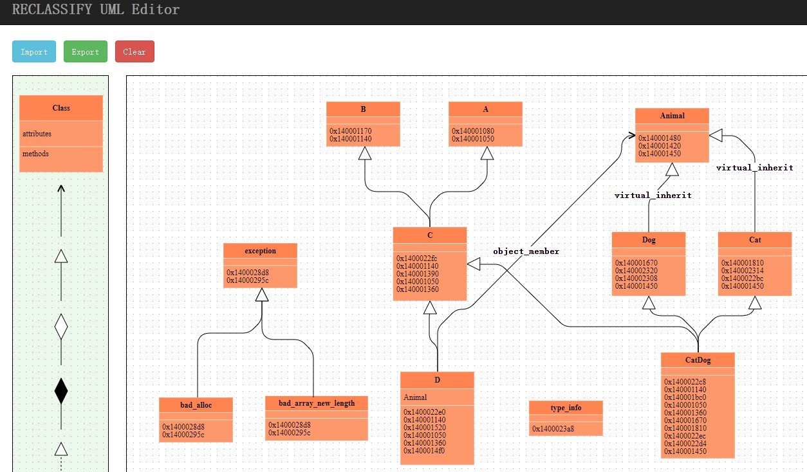

## RECLASSIFY

RECLASSIFY是一个C++二进制代码类信息恢复的IDA插件，可支持RTTI恢复和无RTTI恢复，并内置UML编辑器。目前支持PE 64位文件和ELF 64位文件。

## Windows环境部署

python环境：python2

IDA Pro>=7.0

1. pip下载以下依赖

   ```
   pip install pyvex==7.8.9.26
   pip install unicorn
   pip install cle==7.8.9.26
   pip install claripy==7.8.9.26
   ```

2. 下载安装capstone

   先配置好VS环境变量，如下所示

   ```
   INCLUDE
   E:\Microsoft Visual Studio\2017\Community\VC\Tools\MSVC\14.16.27023\include;E:\Windows Kits\10\Include\10.0.17763.0\ucrt;E:\Windows Kits\10\Include\10.0.17763.0\um;E:\Windows Kits\10\Include\10.0.17763.0\shared;
   
   LIB
   E:\Microsoft Visual Studio\2017\Community\VC\Tools\MSVC\14.16.27023\lib\x64;E:\Microsoft Visual Studio\2017\Community\VC\Tools\MSVC\14.16.27023\lib\x86;E:\Windows Kits\10\Lib\10.0.17763.0\ucrt\x64;E:\Windows Kits\10\Lib\10.0.17763.0\ucrt\x86;E:\Windows Kits\10\Lib\10.0.17763.0\um\x64;E:\Windows Kits\10\Lib\10.0.17763.0\um\x86;
   
   PATH
   E:\Microsoft Visual Studio\2017\Community\VC\Tools\MSVC\14.16.27023\bin\Hostx64\x64
   ```

   然后pip下载capstone

   ```
   pip install capstone==3.0.5
   ```

3. pipy下载angr 7.8.9.26(直接pip无法成功安装)，下载后修改setup.py文件，将capstone的依赖去掉（之前已经安装好了），然后执行以下命令

   ```
   python setup.py build
   python setup.py install
   ```

   若gitpython或者gitdb报错，则把gitpython的依赖也去掉

4. 安装[graphviz](https://graphviz.gitlab.io/download/)，并设置环境变量

   ```
   PATH
   F:\Graphviz2.38\bin
   ```

   然后pip安装graphviz的python接口

   ```
   pip install graphviz
   ```

5. 将RECLASSIFY.py放入`IDA\plugins`中，将RECLASSIFY文件夹放入`IDA\python`中

## 使用

### RTTI恢复

热键：Ctrl+R

可恢复类关系：单一继承，多重继承，虚继承

优点：利用二进制文件中的RTTI信息，恢复速度快，恢复精度高

缺点：不可恢复对象成员，当二进制文件中的RTTI被去掉时该方法无效

生成文件：

- result：结果统计
- NodeTree.gv：类结构图的dot文件，适用DOT语言描述，可编辑
- NodeTree.gv.pdf：类结构图的pdf文件，由graphviz生成
- NodeTreejson.txt：类结构图的json格式文件


### 无RTTI恢复

热键：Ctrl+W

可恢复类关系：单一继承，多重继承，虚继承，对象成员

优点：不依赖RTTI，适用任何环境，且可恢复对象成员

缺点：恢复速度较慢，恢复精度较低

生成文件：

- vftable：记录二进制文件中提取出的vftable
- vbtable：记录二进制文件中提取出的vbtable（分析PE文件时才有）
- VTT：记录二进制文件中提取出的VTT（分析ELF文件时才有）
- symbol：记录二进制文件中的系统符号
- ctor：记录二进制文件中识别的构造函数
- result：结果统计
- NodeTree.gv：类结构图的dot文件，适用DOT语言描述，可编辑
- NodeTree.gv.pdf：类结构图的pdf文件，由graphviz生成
- NodeTreejson.txt：类结构图的json格式文件


### UML编辑器

热键：Ctrl+U

Import：将类结构图的json格式文件导入到UML编辑器中

Export：将UML编辑器中的内容导出到指定位置，保存格式为json格式

Clear：清空UML编辑器中的内容



左边的工具栏可以拖拽到右边的画布中进行类和类关系的添加

双击类框可以进行类的修改


双击类关系的边可以进行类关系的修改


